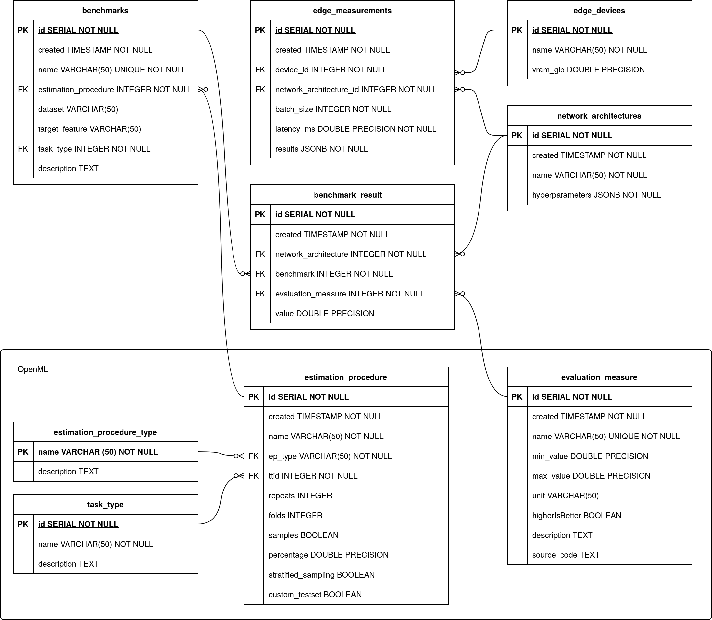

# HPC2edge Database

Database module of HPC2edge.

## Data model

This data model allows for asynchronous and flexible exchange of data between the edge and the HPC sides. The bulk of the data (`network_architectures/hyperparameters` and `edge_measurements/results`) is stored as JSON, thus allowing to store more or less information depending on the use case. 

This database schema is designed to be compatible with
OpenML, which is an open platform for sharing datasets, algorithms, and
experiments.

### HPC

The optimizer side (HPC) will insert into the `network_architectures` table and poll the `edge_measurements` table for new inference results based on the creation date to finally populate `benchmark_results`.

### Edge

On the target side (Edge) the principle is similar but reversed: polling for new `network_architectures` and inserting into `edge_measurements`.
