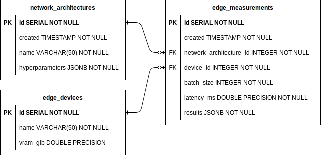

# HPC2edge Database

Database module of HPC2edge.

## Data model

This simple data model allows for asynchronous and flexible exchange of data between the edge and the HPC sides. The bulk of the data (`submissions/model_parameters` and `results/results`) is stored as JSON, thus allowing to store more or less information depending on the use case.

### HPC

The optimizer side (HPC) will insert into the `submissions` table and poll the `results` table for new inference results based on the creation date.

### Edge

On the target side (Edge) the principle is similar but reversed: polling for new `submissions` and inserting into `results`.
